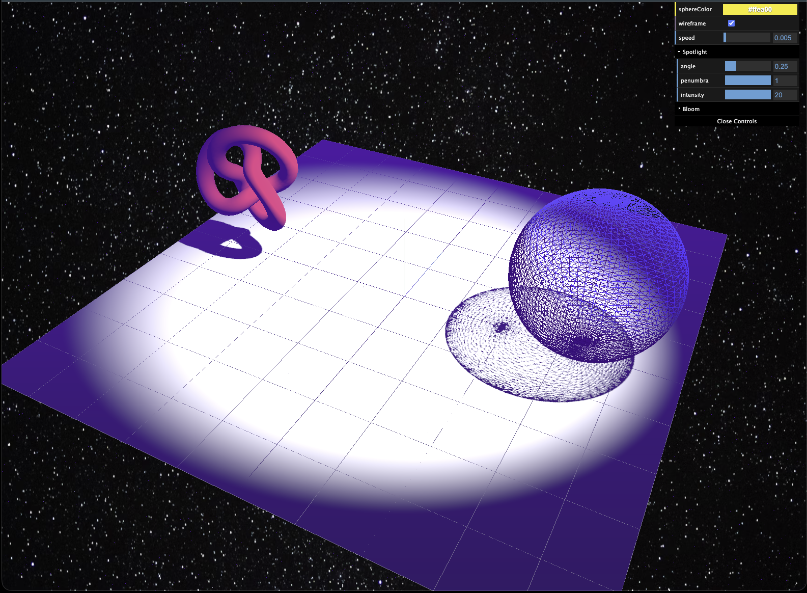

# Three.js Learning Project

A personal project for learning and experimenting with the `three.js` library. This scene explores various features including lighting, shadows, post-processing (bloom), particle systems, and interactive UI elements using a raycaster.
